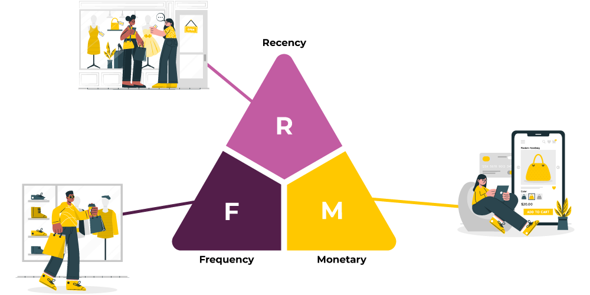

# RFM Customer Segmentation & KMeans Clustering

## 📌 Introduction
- Motivation: Use data available, segment customers into different groups

## Data Overview:
- Variables: purchased date and invoice data

## Technology Used

<ul>
  <li>RFM value</li>
  <li>KMeans</li>
  <li>3D graph</li>
</ul>

## Contents

<h3>1. Calculate RFM value</h3>
<h3>2. Customer segmentation/h3>

## Conclusion

- Sucessfully segment customers into 3 groups

## Projects Completed

1. <a href="https://github.com/lyphuong601/job-postings-data-cleaning">Job Posting Data Cleaning</a>
2. <a href="https://github.com/lyphuong601/data-science/tree/main/linear-regression-BGD-deployment">House Price Predictions</a>
3. <a href="https://github.com/lyphuong601/adventuework-inc-da-project"> Adventuework Inc DA Project</a>

More projects coming up soon. Do drop a ⭐ if you like it.